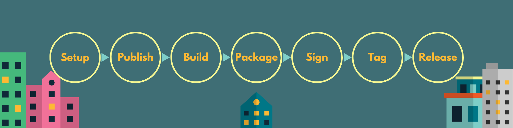

# 

An all-in-one action to build, optimise, tag, sign, and publish a Cargo-based Rust project.

## Purpose

This action is your one-stop shop for building and publishing a Rust project. It will:
- Install the Rust toolchain and target, including necessary components
- Use [cross] for cross-compilation if needed
- Enable some useful compiler options by default, like:
  + building the standard library (`-Z build-std`),
  + codegen units for maximum optimisations (`-C codegen-units=1`),
  + static linking of libgcc for musl builds (`-C link-arg=-static-libgcc`),
  + outputting split debuginfo (`-C split-debuginfo=packed`).
- Package binaries and support files in an archive
- Sign the archive with [sigstore]'s [cosign]
- Tag the release if it isn't already, and sign the tag with [gitsign]
- Publish the crate to crates.io
- Publish the archives to GitHub Releases

It can be used standalone, as part of your own release workflow, or alongside our own [release-pr]
and [release-meta] actions. See the `onrelease` workflow in the test repo for [a complete example]
of the latter.

[release-pr]: https://github.com/cargo-bins/release-pr
[release-meta]: https://github.com/cargo-bins/release-meta
[a complete example]: https://github.com/passcod/cargo-release-pr-test/blob/main/.github/workflows/onrelease.yml
[cargo-binstall]: https://github.com/cargo-bins/cargo-binstall
[cross]: https://github.com/cross-rs/cross
[sigstore]: https://sigstore.dev
[cosign]: https://github.com/sigstore/cosign
[gitsign]: https://github.com/sigstore/gitsign

Sounds complicated? Fear not! In most cases, using this action is the job of only few lines of YAML:

```yaml
permissions:
  id-token: write
  contents: write

steps:
- uses: actions/checkout@v3
- uses: cargo-bins/release-rust@v1
  with:
    github-token: ${{ secrets.GITHUB_TOKEN }}
    crates-token: ${{ secrets.CRATES_TOKEN }}
    target: ${{ matrix.target }}
```

- **Examples**
  + [Basic usage](#basic-usage)
  + [Running on tags](#running-on-tags)
  + [Installing compile-time dependencies](#installing-compile-time-dependencies)
  + [Custom build: justfile](#custom-build-justfile)
  + [Custom build: meson](#custom-build-meson)
  + [Compile out panic messages](#compile-out-panic-messages)
  + [Universal binaries on macOS](#universal-binaries-on-macos)
  + [Filtering crates](#filtering-crates)
  + [Filtering binaries](#filtering-binaries)
  + [Publishing to crates.io before or after packaging anything](#publishing-to-cratesio-before-or-after-packaging-anything)
  + [Extra signing attestations](#extra-signing-attestations)
  + [Distribute signatures alongside packages](#distribute-signatures-alongside-packages)
  + [Sign using GPG instead](#sign-using-gpg-instead)
- **Documentation**
  + [Inputs and outputs](#inputs)
  + [Github token permissions](#github-token-permissions)
  + [Checkout](#checkout)
  + [Packaging](#packaging)
  + [Custom build](#custom-build)
  + [Workspaces](#with-multiple-crates)
  + [Registry publish only](#cratesio-publish-only-mode)
  + [Tag and release signing](#signing)
  + [Step by step action flow](#action-flow)
  + [Hook context](#hook-context)

## Examples

### Basic usage

This example runs when pull requests tagged with a `release` label are merged to the `main` branch.

It builds the project for six targets (x64 and ARM64 for the big three platforms) and otherwise uses
all defaults: compiles with `build-std`, packs the debuginfo, uses zip archives, publishes to
crates.io, pushes a tag, publishes to GitHub releases, and uploads signatures to sigstore. The
binaries can then be securely installed with [`cargo binstall`][cargo-binstall].

```yaml
name: Release on PR merge
on:
  pull_request:
    types: closed
    branches: [main] # target branch of release PRs

jobs:
  release:
    if: github.event.pull_request.merged && contains(github.event.pull_request.labels.*.name, 'release')
    strategy:
      fail-fast: false
      matrix:
        include:
        - { o: macos-latest,    t: x86_64-apple-darwin        }
        - { o: macos-latest,    t: aarch64-apple-darwin       }
        - { o: ubuntu-latest,   t: x86_64-unknown-linux-musl  }
        - { o: ubuntu-latest,   t: aarch64-unknown-linux-musl }
        - { o: windows-latest,  t: x86_64-pc-windows-msvc     }
        - { o: windows-latest,  t: aarch64-pc-windows-msvc    }

    name: ${{ matrix.t }}
    runs-on: ${{ matrix.o }}
    permissions:
      id-token: write
      contents: write

    steps:
    - uses: actions/checkout@v3
    - uses: cargo-bins/release-rust@v1
      with:
        github-token: ${{ secrets.GITHUB_TOKEN }}
        crates-token: ${{ secrets.CRATES_TOKEN }}
        target: ${{ matrix.t }}
```

### Running on tags

This example runs when a version tag is pushed. While the action would detect the tag exists before
pushing it, we disable tag publishing to save a little time. Otherwise it does everything the above
example does.

```yaml
name: Release on tag push
on:
  push:
    tag: v*.*.*

jobs:
  release:
    strategy:
      fail-fast: false
      matrix:
        include:
        - { o: macos-latest,    t: x86_64-apple-darwin        }
        - { o: macos-latest,    t: aarch64-apple-darwin       }
        - { o: ubuntu-latest,   t: x86_64-unknown-linux-musl  }
        - { o: ubuntu-latest,   t: aarch64-unknown-linux-musl }
        - { o: windows-latest,  t: x86_64-pc-windows-msvc     }
        - { o: windows-latest,  t: aarch64-pc-windows-msvc    }

    name: ${{ matrix.t }}
    runs-on: ${{ matrix.o }}
    permissions:
      id-token: write
      contents: write

    steps:
    - uses: actions/checkout@v3
    - uses: cargo-bins/release-rust@v1
      with:
        github-token: ${{ secrets.GITHUB_TOKEN }}
        crates-token: ${{ secrets.CRATES_TOKEN }}
        target: ${{ matrix.t }}
        publish-tag: false
```

### Installing compile-time dependencies

Here we build a project that requires [compiler-rt] (provided in Ubuntu by `libblocksruntime-dev`),
but only for the `x86_64-unknown-linux-musl` target. The [post-setup hook] is used to install the
dependency after the action finishes setting up the build environment.

[post-setup hook]: #hooks
[compiler-rt]: https://compiler-rt.llvm.org

```yaml
- uses: cargo-bins/release-rust@v1
  with:
    github-token: ${{ secrets.GITHUB_TOKEN }}
    crates-token: ${{ secrets.CRATES_TOKEN }}
    target: ${{ matrix.target }}
    post-setup: |
      if [ "${{ runner.os }}" = "Linux" ] && [ "${{ matrix.target }}" = "x86_64-unknown-linux-musl" ]; then
        sudo apt install -y libblocksruntime-dev # for compiler-rt
      fi
```

### Custom build: justfile

Here we have [a project][cargo-binstall] that uses [just] to build the project. A [post-setup hook]
is also used here to install the `just` CLI tool: it does so using [cargo-binstall] which is
installed by the action as part of setup. Because `custom-build` is used, the action won't install
the `rust-src` component by default, so we add it manually as well.

[just]: https://just.systems

```yaml
- uses: cargo-bins/release-rust@v1
  with:
    github-token: ${{ secrets.GITHUB_TOKEN }}
    crates-token: ${{ secrets.CRATES_TOKEN }}
    target: ${{ matrix.target }}
    extra-rustup-components: rust-src
    post-setup: |
      cargo binstall -y --force just
      just ci-install-deps
    custom-build: just build
```

### Custom build: meson

Here's a hypothetical configuration for [a project][pods] which uses [meson] to build. A
[post-setup hook] is used to install meson, and the project's dependencies. Finally, the
`package-files` option is used to gather the build outputs to package, as the meson build won't have
put anything in the places the action expects to find them. Note that this example doesn't provide a
`crates-token`, so the action won't publish to crates.io.

[meson]: https://mesonbuild.com
[pods]: https://github.com/marhkb/pods

```yaml
- uses: cargo-bins/release-rust@v1
  with:
    github-token: ${{ secrets.GITHUB_TOKEN }}
    target: ${{ matrix.target }}
    post-setup: |
      sudo apt install -y meson ninja appstream-glib glib2 gtk4 libadwaita libpanel gtksourceview vte-2.91-gtk4
      meson _build --prefix=/usr/local
    custom-build: ninja -C _build
    package-files: |
      _build/src/pods
      _build/po
      _build/data/*
```

### Compile out panic messages

While this is not an optimisation that is on by default, it can be useful to reduce the size of
binaries. By passing a few extra flags, we can instruct the compiler to remove all panic messages
from the binary. This is done by forcing `panic = "abort"` in the release profile and enabling the
immediate-abort-on-panic feature for `build-std`:

```yaml
- uses: cargo-bins/release-rust@v1
  with:
    github-token: ${{ secrets.GITHUB_TOKEN }}
    crates-token: ${{ secrets.CRATES_TOKEN }}
    target: ${{ matrix.target }}
    extra-cargo-flags: |
      --config='profile.release.panic="abort"'
      -Z build-std=std,panic_abort
      -Z build-std-features=panic_immediate_abort
```

### Universal binaries on macOS

A macOS concept is [universal binaries], which contain code for multiple architectures. This action
cannot build these directly, but the companion [release-lipo] action will read from an existing
release, download `*-apple-darwin` packages and extract them, combine the binaries with [`lipo`],
then repackage and upload the result:

[universal binaries]: https://developer.apple.com/documentation/apple-silicon/building-a-universal-macos-binary
[release-lipo]: https://github.com/cargo-bins/release-lipo
[`lipo`]: https://ss64.com/osx/lipo.html

```yaml
name: Release on tag push
on:
  push:
    tag: v*.*.*

jobs:
  release:
    strategy:
      fail-fast: false
      matrix:
        include:
        - { o: macos-latest,    t: x86_64-apple-darwin        }
        - { o: macos-latest,    t: aarch64-apple-darwin       }
        - { o: ubuntu-latest,   t: x86_64-unknown-linux-musl  }
        - { o: ubuntu-latest,   t: aarch64-unknown-linux-musl }
        - { o: windows-latest,  t: x86_64-pc-windows-msvc     }
        - { o: windows-latest,  t: aarch64-pc-windows-msvc    }

    name: ${{ matrix.t }}
    runs-on: ${{ matrix.o }}
    permissions:
      id-token: write
      contents: write

    steps:
    - uses: actions/checkout@v3
    - uses: cargo-bins/release-rust@v1
      with:
        github-token: ${{ secrets.GITHUB_TOKEN }}
        crates-token: ${{ secrets.CRATES_TOKEN }}
        target: ${{ matrix.t }}
        publish-tag: false

  lipo:
    needs: release
    runs-on: macos-latest
    permissions:
      id-token: write
      contents: write

    steps:
    - uses: cargo-bins/release-lipo@v1
      with:
        github-token: ${{ secrets.GITHUB_TOKEN }}
```

### Filtering crates

Within a workspace, sometimes only a subset of crates should be build and packaged. This set of
crates is adjustable with the `crates` option, which takes a newline-separated list of crate names:

```yaml
- uses: cargo-bins/release-rust@v1
  with:
    github-token: ${{ secrets.GITHUB_TOKEN }}
    crates-token: ${{ secrets.CRATES_TOKEN }}
    target: ${{ matrix.target }}
    crates: |
      my-crate
      my-other-crate
```

When there are many crates with similar names, you can use glob patterns to match them:

```yaml
- uses: cargo-bins/release-rust@v1
  with:
    github-token: ${{ secrets.GITHUB_TOKEN }}
    crates-token: ${{ secrets.CRATES_TOKEN }}
    target: ${{ matrix.target }}
    crates: |
      *-cli
      other-tool
```

How this works is that the action will run `cargo metadata` to get a list of all crates in the
workspace, then filter that list by the glob patterns.

You can also use negative patterns to exclude crates:

```yaml
- uses: cargo-bins/release-rust@v1
  with:
    github-token: ${{ secrets.GITHUB_TOKEN }}
    crates-token: ${{ secrets.CRATES_TOKEN }}
    target: ${{ matrix.target }}
    crates: |
      *-cli
      !not-this-cli
```

You should take care to [read through the behaviour section for multiple crate publishing](#with-multiple-crates).
Notably, you may want to set the first crate in the list explicitly as it may affect names and tags.

### Filtering binaries

By default, all binaries in the workspace, or in the set of `crates` being built, will be packaged.
To filter these, use the [`pre-package` hook] to run a script that will remove unwanted binaries:

[`pre-package` hook]: #hooks

```yaml
- uses: cargo-bins/release-rust@v1
  with:
    github-token: ${{ secrets.GITHUB_TOKEN }}
    crates-token: ${{ secrets.CRATES_TOKEN }}
    target: ${{ matrix.target }}
    pre-package: |
      rm -r example{-,_}tool{,.*}
```

The `{-,_}` and `{,.*}` expressions will match both the binary on unix and windows, and the
debuginfo packages for that binary, without matching files that start with the same thing, like
`example-tool*` would.

### Publishing to crates.io before or after packaging anything

You may want to control _when_ the crate is published to crates.io, or stop the release if it fails.
This cannot be done directly with this action, as by nature it will run in parallel across the job's
target matrix. However, you can set up a dependent job that runs before or after the release job:

```yaml
name: Release on tag push
on:
  push:
    tag: v*.*.*

jobs:
  publish:
    runs-on: ubuntu-latest
    steps:
    - uses: actions/checkout@v3
    - uses: cargo-bins/release-rust@v1
      with:
        github-token: ${{ secrets.GITHUB_TOKEN }}
        crates-token: ${{ secrets.CRATES_TOKEN }}
        publish-crate-only: true

  release:
    needs: publish
    strategy:
      fail-fast: false
      matrix:
        include:
        - { o: macos-latest,    t: x86_64-apple-darwin        }
        - { o: macos-latest,    t: aarch64-apple-darwin       }
        - { o: ubuntu-latest,   t: x86_64-unknown-linux-musl  }
        - { o: ubuntu-latest,   t: aarch64-unknown-linux-musl }
        - { o: windows-latest,  t: x86_64-pc-windows-msvc     }
        - { o: windows-latest,  t: aarch64-pc-windows-msvc    }

    name: ${{ matrix.t }}
    runs-on: ${{ matrix.o }}
    permissions:
      id-token: write
      contents: write

    steps:
    - uses: actions/checkout@v3
    - uses: cargo-bins/release-rust@v1
      with:
        github-token: ${{ secrets.GITHUB_TOKEN }}
        target: ${{ matrix.t }}
        publish-tag: false
        publish-crate: false
```

You should take note of [the particular behaviour of the `publish-crate-only` option](#cratesio-publish-only-mode).

### Extra signing attestations

TODO: with extra cosign flags

### Distribute signatures alongside packages

TODO: use extra cosign flags to write sig to outside, use post-package hook to bring sig files back in

### Sign using GPG instead

TODO: disable sigstore, using post-sign hook to sign and write sig to outside, use post-package hook to bring sig files back in

## Inputs

| Name | Default | Description |
|:-|:-:|:-|
| __🔑 Credentials__ |||
| `github-token` | **required** | A github token to interact with the API and to use for OIDC claims. |
| `crates-token` | _optional_ | A crates.io token with publish scope for the crate(s). If not provided, crates will not be published. |
| __🧰 Setup options__ |||
| `toolchain` | `'nightly'` | The rust toolchain to use. |
| `target` | _host target_ | The target to install and build for. |
| `binstall-version` | _latest_ | Specify the [cargo-binstall] version to use (0.20.0 and above). |
| `cosign-version` | _latest 1.x_ | Specify the [cosign] version to use (1.13.0 and above). |
| `cross-version` | _latest_ | Specify the [cross] version to use (0.2.0 and above). |
| __⚒️ Compilation options__ |||
| `crates` | _all crates_ | Newline-separated list of crate globs to build within the workspace. |
| `features` | _optional_ | Newline-separated features to enable when building. |
| `buildstd` | _see [Build-std](#build-std)_ | Set to `false` to disable building the standard library from source. |
| `debuginfo` | _see [Split debuginfo](#debuginfo)_ | Set to `false` to disable generating and outputting split debuginfo. |
| `musl-libgcc` | `true` | Set to `false` to disable static-linking libgcc for musl builds. |
| `use-cross` | `'auto'` | Force use of cross to compile. By default, will use cross if the target is not the host target. |
| __🚩 Extra flags__ |||
| `extra-rustup-components` | _optional_ | Extra components to install with rustup. |
| `extra-cargo-flags` | _optional_ | Extra flags to pass to cargo build. |
| `extra-rustc-flags` | _optional_ | Extra flags to pass to rustc (RUSTFLAGS). |
| `extra-cosign-flags` | _optional_ | Extra flags to pass to cosign. |
| __🥡 Packaging__ |||
| `package-archive` | `'zip'` | [Packaging archive format](#packaging). |
| `package-files` | _optional_ | Newline-separated list of file globs to include in the package in addition to compiled binaries. |
| `package-name` | _see [Packaging](#packaging) and [`package-separately`](#package-separately)_ | Name of the package, excluding the extension. |
| `package-in-dir` | `true` | Wrap the package contents in a directory with the same name before archiving. |
| `package-separately` | `false` | Package each crate separately. |
| `package-short-ext` | `false` | Use the short variant of the archive extension, if relevant for the format. E.g. `tgz` instead of `tar.gz`. |
| `package-output` | `'packages/'` | Path to write finished packages to. |
| `package-sign` | `true` | Set to `false` to disable signing packages (with sigstore by default). |
| __📦 Crate publishing__ |||
| `publish-crate` | `true` | Set to `false` to disable publishing to crates.io. |
| `publish-crate-only` | `false` | Set to `true` to _only_ publish to crates.io. See [Crates.io publish only mode](#cratesio-publish-only-mode) for how this affects hooks. |
| `publish-all-crates` | `false` | Set to `true` to publish to crates.io all crates [that need it](#publish-all-crates). |
| `publish-registry` | _optional_ | Registry to publish to. This overrides the `Cargo.toml` configuration. |
| __🎫 Tags__ |||
| `tag` | _version_ | Tag to create or use for the release. Set to `false` to disable tagging. This will imply `release: false`. |
| `tag-crates` | `true` | Set to `false` to disable tagging crate publishes. |
| `tag-sign` | `true` | Set to `false` to disable signing tags (with sigstore by default). |
| __🚢 Github release__ |||
| `release` | `true` | Set to `false` to disable publishing a GitHub release. Packages will be left in the `packages/` directory. |
| `release-notes` | _optional_ | Body of the github release. |
| `release-name` | _version_ | Name of the github release. |
| `release-separately` | `false` | Create a release for each crate. |
| `release-latest` | _see [Release phase](#release-phase)_ | Set to `true` to mark the release as the latest, or to a crate name to mark so if `release-separately` is `true`. |
| `release-pre` | `false` | Set to `true` to mark the release as a pre-release, or to a newline-separated pattern list of crates to mark so. |
| __🪝 Hooks__ |||
| `post-setup` | _optional_ | Script to run after toolchain setup. |
| `post-publish` | _optional_ | Script to run after publishing to crates.io. |
| `custom-build` | _optional_ | Completely [custom build script](#custom-build). Compilation options and extra cargo/rustc flags will be ignored if this is set. |
| `post-build` | _optional_ | Script to run after building. |
| `pre-package` | _optional_ | Script to run immediately before packaging. |
| `post-package` | _optional_ | Script to run after packaging. |
| `post-sign` | _optional_ | Script to run after signing. |
| `post-release` | _optional_ | Script to run after releasing to Github. |
| `hooks-shell` | `'bash'` | Shell to use for all hooks. |

The action needs no dependencies and runs on all hosted-spec runners (or compatible).

### Outputs

All outputs of a Github Action are strings.

| Name | Description |
|:-|:-|
| `files` | Newline-separated list of files generated by the action. This does not include all built files, only those within the `package-output` path. |

## Github token permissions

The github token needs to have:
- `write` permission for `id-token` (OIDC for signing)
- `write` permission for `contents` (releases and tags)

## Checkout

You're responsible for checking out the repository at the right commit for the build. In most cases,
this will be the default behaviour of `actions/checkout@v3`, but in some situations you may need to
specify its `ref` input.

This action also does not bump versions or commit to the repository. You can use [release-pr] for
that if you want a PR-based workflow, push to the repository directly, or use a different tool. It's
up to you.

## Build-std

The [`build-std` feature] lets Cargo compile the standard library itself. It generally produces
smaller or better-optimized binaries, but it's not always available, desired, or even working.

[`build-std` feature]: https://doc.rust-lang.org/cargo/reference/unstable.html#build-std

This action uses `build-std` by default **if**:
- the `toolchain` selected is the latest nightly, or a dated nightly after `2020-01-01`, _and_
- the `target` is one of a [hardcoded list of targets](./src/build-std-targets.ts), _and_
- the `buildstd` input is not set to `false`.

## Debuginfo

The [`split-debuginfo` feature] lets rustc produce separate debuginfo files for binaries. This can
significantly reduce the size of the final executable, while providing a way to debug it if needed.
Specifically, the `packed` variant of the feature produces a single file containing all debuginfo,
which is handy for packaging and distributing!

[`split-debuginfo` feature]: https://doc.rust-lang.org/rustc/codegen-options/index.html#split-debuginfo

This action uses `split-debuginfo` by default **if**:
- the `toolchain` selected is the latest `stable` or `nightly`, a [stable >=1.65.0][stable-linux-d],
  or a dated nightly after `2022-09-01`, _and_
- the `debuginfo` input is not set to `false`.

[stable-linux-d]: https://blog.rust-lang.org/2022/11/03/Rust-1.65.0.html#splitting-linux-debuginfo

## Packaging

The `package-archive` input selects the package archive format. For all compressed formats, the
maximum compression setting is used.

| Value | Description |
|:-:|:-|
| `none` | Do not archive the package. This is an advanced option, and you should use [package hooks](#hooks) alongside it, otherwise you may not have anything to upload. |
| `zip` | ZIP archive, with DEFLATE compression. This is the default, as it has the widest compatibility. |
| `tar+gzip` | Posix (pax) TAR archive, with GZIP compression. |
| `tar+bzip2` | Posix (pax) TAR archive, with BZIP2 compression. |
| `tar+xz` | Posix (pax) TAR archive, with XZ compression. |
| `tar+zstd` | Posix (pax) TAR archive, with ZSTD compression. |

There's no support to select different formats based on the target: if you wish to, you should make
that logic yourself in the workflow, prior to calling this action.

The `package-name` input is a template string that will be used to name the package, and defaults to
`{release-name}-{target}`. The following placeholders can be used:

- `{target}`: The target being built for.
- `{crate-name}`: The name of the crate being packaged.
- `{release-name}`: The [name of the release](#with-multiple-crates) being created.
- `{crate-version}`: The version of the crate being packaged.
- `{release-version}`: The version of the release being created.

See the [With multiple crates](#with-multiple-crates) section for more details on the difference
between `crate` and `release` names and versions.

## Custom build

When providing a `custom-build` script, the action will ignore:
- `features`
- `buildstd`
- `debuginfo`
- `musl-libgcc`
- `use-cross`
- `extra-cargo-flags`
- `extra-rustc-flags`

It will also not move the built binaries and debuginfo to the temporary packaging directory, so you
must do that with the `pre-package` hook and/or with the `package-files` input.

## With multiple crates

When the action is run in a workspace, it will build and package all crates in the workspace by
default, but it will use the "first" binary crate as the source for the names and versions of the
release and package, and only publish that one to crates.io.

That "first" crate is determined by sorting the names of all binary crates in the workspace in
lexicographic order, and using the first one, or by the first entry in the `crates` input. If the
first entry in the `crates` input is a glob pattern, the first lexicographic match in its expansion
will be used. This is also called the `release-name` (e.g. in the `package-name` template).

This behaviour makes it easy to use the action in the common situation of a workspace with a single
binary crate and multiple library crates it depends on or relates to. For other situations, options
are available to specify what and how to build, publish, and package.

### `publish-all-crates`

With `publish-all-crates: true`, the action will look up the versions of all crates in the workspace
against the registry, and publish all the ones that are not already published. This is separate from
the `crates` input and build configuration: if a crate is not published, it will still be built and
packaged if it is in the `crates` list.

However, it does affect the Github releases if `release-separately` is `true`: each published crate
will be released, even if no package was generated for it.

If `tag` or `tag-crate` is false, crates will be published to the registry, but not
tagged in the repository. Otherwise, a tag will be created for each published crate.

### `package-separately`

The action will create a package for each crate's binaries. The `package-name` input changes its
default to `{crate-name}-{target}`, so that each package has a different name.

By default, all packages will be uploaded to the same release. If `release-separately` is `true`,
each package will be uploaded to its own release.

### `release-separately`

The action will create a tag and release for each published crate, and upload the package (if any)
for that crate to that release. It implies `package-separately: true`.

The `release-notes` and `release-name` inputs will attempt to parse as JSON. If they are valid JSON,
they will be parsed as an object mapping crate names to their respective values. If they are not,
they will be used as that value for all crates. The `$default$` key can be used to specify a value
that will be used for crates not otherwise present in the object.

See [Tag phase](#tag-phase) and [Release phase](#release-phase) for how this input affects them.

## Crates.io publish only mode

When `publish-crate-only` is `true`, the action will only publish to crates.io. This is useful in
some cases like [splitting the crates.io publish and the rest](#publishing-to-cratesio-before-or-after-packaging-anything)
as the toolchain setup can then be easily kept consistent between the two jobs.

In that mode:
- The setup phase is run.
- The publish phase is run.
  + If `publish-all-crates` is `true`, and:
    * all the crates are already up to date, the action fails.
    * any crate needs publishing, they are.
  + otherwise, only the first/"release" crate is published:
    * if it is already up to date, the action fails.
- The action stops there.

If you want to _only_ publish to crates.io and _not_ package the binaries in a separate job or
workflow, you should not use this action, and do something like this instead:

```yaml
- uses: actions/checkout@v3
- run: |
    rustup toolchain install stable --profile minimal --no-self-update
    rustup default stable
- run: cargo publish
```

## Signing

TODO

## Action flow



A particularity is that hooks run even if their phase's purpose is disabled, so they can be used to
replace the functionality of a phase without changing the rest of the action.

### Setup phase

All of these are always performed, even if the phase they are used in is disabled: this makes it
possible to use hooks to replace phases without having to download these tools.

Rust:

- If `buildstd` is `true`, the `rust-src` component is added to the `extra-rustup-components`.
- The `toolchain` is installed, in minimal profile, with the required components.
- The `target` is added.
- The toolchain is set as the default.

Binstall:

- Version 0.20.0 is downloaded for the current platform, and checked against
  checksums hardcoded in this action (bootstrap).
- Binstall is securely self-upgraded to the latest (or desired) version.

Cross:
<!-- update if/when cross gets signed packages -->

- `taiki-e/install-action`'s [cross manifest](https://github.com/taiki-e/install-action/blob/main/manifests/cross.json)
  is downloaded, and the URL and checksum for the desired version and platform are extracted.
- Cross is downloaded, checked, and installed.

Cosign:

- Version 1.13.0 is downloaded for the current platform, and checked against
  checksums hardcoded in this action (bootstrap).
- Cosign is securely self-upgraded to the latest (or desired) version.
- [gitsign] is downloaded, verified, and installed.

_The `post-setup` hook is run._

### Publish phase

- The action looks up the name of every crate in the workspace.
- The `crates` input is evaluated as a list of globs, and matched against this list. The result is
  the list of crates to package and release.
- The action queries the `publish-registry` for the versions of each crate from that list (or from
  the list of all crates if `publish-all-crates` is `true`) and compares them to the local version.
  + If the local version is already published, and:
    * `release-separately` is `true`: the crate is removed from the list of crates.
    * `release-separately` is `false`: the crate is removed only from the list of crates to publish.
  + Otherwise, the crate is kept in the list.
- Crates from that list that are publishable are published to the `publish-registry`.
  + if `publish-crate-only` is `true` and the list is empty, the action fails.
- _The `post-publish` hook is run._
- If `publish-crate-only` is true, the action stops here.

### Build phase

- _If `custom-build` is set, it is called._
- Otherwise, the build command is assembled and called.
  + if `use-cross` is `true`, the `cross` command is used instead of `cargo`.
  + the `--release` cargo profile is used.
  + the `--target` cargo option is set to the `target` input.
  + if `buildstd` is `true`, flags to build std as part of compilation are added to cargo.
  + if `debuginfo` is `true`, flags to produce packed split debuginfo are added to cargo.
  + if `musl-libgcc` is `true`, flags to statically link `libgcc` are added to RUSTFLAGS iff the target's libc variant is musl.
  + the `extra-cargo-flags` input is stripped of newlines and appended to cargo.
  + the `extra-rustc-flags` input is stripped of newlines and appended to RUSTFLAGS.
- _The `post-build` hook is run._

### Package phase

If `package-separately` is `true`, the following is run once for each crate:

- A temporary directory is created.
- If `custom-build` was not used, the binaries and debuginfo are copied to the temporary directory.
  - if a nightly compiler was used, JSON output was enabled and parsed to find these artifacts.
  - otherwise, the action guesses at the location of the built binaries and debuginfo.
- The `package-files` input is evaluated and its results are copied to the temporary directory.
- _The `pre-package` hook is run (for each package if `package-separately` is true)._
- If `package-in-dir` is `true`, another directory named `package-name` is created, and the contents
  of the temporary directory are moved into it.
- If `package-archive` is not `none`, the temporary directory is archived and named `package-name`
  with the archive-appropriate extension, into the `package-output` directory.

_The `post-package` hook is run (only once)._

### Sign phase

If `package-sign` is `true`, then for each file in the `package-output` directory:

- The file is signed with `cosign sign-blob`, using GitHub's OIDC identity and keyless signing.

_The `post-sign` hook is run (only once)._

### Tag phase

If `tag` is not `false`, and:
- `publish-all-crates` and `release-separately` are both `false`:
  + The `tag` input is evaluated as a template (same placeholders as [`package-name`](#packaging)).
  + An annotated tag is created at the current commit.
    * If `tag-sign` is `true`, the tag is signed with [gitsign].
- otherwise
  + for each published crate:
    * The `tag` input is evaluated with `crate-name` and `crate-version` as that crate's.
    * An annotated tag is created at the current commit (and signed if enabled).
  + for the release as a whole, if the `release-crate` is not within the set of published crates:
    * The `tag` input is evaluated as normal.
    * An annotated tag is created at the current commit (and signed if enabled).
- All created tags are pushed to the repo.

_The `post-tag` hook is run (only once)._

### Release phase

If `release` is not `false`, and:
- `release-separately` is `false`:
  + The `release-name` input is evaluated as a template (same placeholders as [`package-name`](#packaging)).
  + A release is created with the tag created in the previous phase:
    * its name as the `release-name` result;
    * its body as the `release-body` input;
    * marked as latest if `release-latest` is `true` or equal to the `release-name`;
    * marked as pre-release if `release-pre` is `true` or matching the `release-name`.
- otherwise, for each tag created in the previous phase:
  + Each of the `release-name` and `release-body` inputs:
    * is attempted to parse as JSON. If it can be, and it is an object, each key is evaluated as a
      glob pattern against the list of crates, from most precise (proportion of glob characters) to
      least, and the first match is used. If no match is found, the action fails. If the value is
      not JSON, this step is skipped.
    * the value is then evaluated as a template with that crate's `crate-name` and `crate-version`.
  + A release is created with the tag:
    * its name as the `release-name` result;
    * its body as the `release-body` input;
    * marked as latest if `release-latest` is `true` or equal to the `release-name`;
    * marked as pre-release if `release-pre` is `true` or matching the `release-name`.

_The `post-release` hook is run (only once)._

## Hook context

Hooks run in different working directories:

| Hook | Working directory |
|:-:|:-|
| `post-setup` | Runs in the "release root" (see below). |
| `post-publish` | Runs in the "release root". |
| `custom-build` | Runs in the "release root". |
| `post-build` | Runs in the "release root". |
| `pre-package` | Runs in a temporary directory filled with the built binaries and other `package-files`. |
| `post-package` | Runs in the `package-output` directory. |
| `post-sign` | Runs in the `package-output` directory. |
| `post-release` | Runs in the "release root". |

Besides the [GitHub runner environment variables][gh-runner-env], these are set for all hooks:

| Name | Description |
|:-:|:-|
| `RELEASE_ROOT` | The absolute path to the root of the workspace or crate being released. |
| `RELEASE_PACKAGE_OUTPUT` | The absolute path to the directory where packages are created (`package-output`). |
| `RELEASE_TARGET` | The target being built for. |

[gh-runner-env]: https://docs.github.com/en/actions/reference/environment-variables#default-environment-variables

And some are set for specific hooks:

### `post-package`

| Name | Description |
|:-:|:-|
| `RELEASE_CRATE_NAME` | The name of the crate being packaged. |
| `RELEASE_CRATE_VERSION` | The version of the crate being packaged. |
| `RELEASE_PACKAGE_NAME` | The rendered name of the package being created. |
